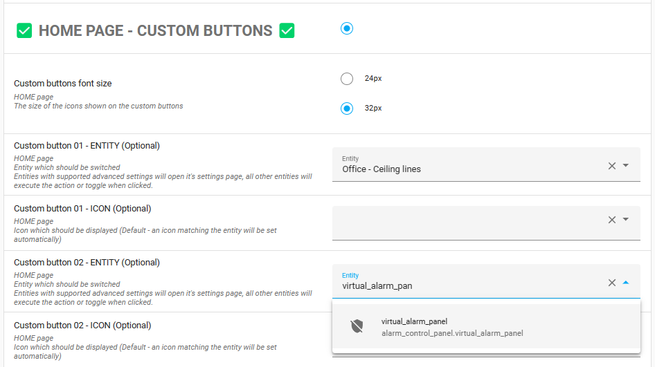

# Alarm Control Panel

You can control an Alarm Control Panel from your NSPanel,
which will allow you to set the alarm mode between the standard modes supported by
Home Assistant (Home, Away, Night, Vacation or Custom bypass) or disarm the alarm.

Currently, only alarms without a code or alarms with a numeric code will be supported.
If your alarm requires a text code, you will still be able to display it on your NSPanel,
however, when you click in any button it will send services calls to Home Assistant
without the code and it will fail for the calls where a code is required.

> [!IMPORTANT]
> **Security advisory**
> By default, the communication between your NSPanel (ESPHome) and Home Assistant (HA) is not encrypted,
> which means a person with access to your network could potentially monitor the communication between your panel and HA and replicate the service calls.
> Although this is not a big issue for most of the service calls (turn-on a light,
close a curtain, etc.), it can be a problem when controlling your alarm system.
>
> Based on that, we hardly reccoment the use of API encryption for all users controlling an Alarm system via a NSPanel.
> You can easily enable this by following the ["API encryption" example available here](customization.md#api-encryption).

## Configuration

### Allow the device to make Home Assistant service calls

First, you have to configure your Home Assistant to allow your panel to make service calls.
All other services are called from the Blueprint, however this requires the ESPHome to send
an event containing in plain text all the information needed to the service call,
which could be a security issue, so all the alarm calls will be driven by the panel to ensure a safer environment.

To enable this option, go to your ESPHome integrations panel (Settings > Devices and Services > ESPHome)
and click "Configure" next to the entry related to your panel:

Then check the option "Allow the device to make Home Assistant service calls":

### Blueprint settings

Alarm Control Panels entities can be assigned to any of the **Custom buttons** on the Home page or any button in the buttons pages.

Open the automation based on the NSPanel Blueprint and look for one of these sections,
choose the button you want to use, select your alarm control panel entity, click "Save", and your are done. :sunglasses:

## Controlling your alarm from your panel

When an alarm control panel is set in your Blueprint automation,
you will see the alarm icon on your panel's Home page.
This icon will change following the alarm state as described in the table below.

A click on that icon will show the Alarm Control Panel page:

You can change your alarm settings with a single click on the button related to the new state
you want to set your alarm to, or close the page to go back to Home page.

### Description of states shown with the alarm icon

State | Color | Icon | Icon name | Description
-- | -- | -- | -- | --
disarmed | White ||mdi:shield-off-outline | The alarm is disarmed (off).
armed_home | Green || mdi:shield-home-outline | The alarm is armed in home mode.
armed_away | Green || mdi:shield-lock-outline | The alarm is armed in away mode.
armed_night | Green || mdi:shield-moon-outline | The alarm is armed in night mode.
armed_vacation | Green || mdi:shield-airplane-outline | The alarm is armed in vacation mode.
armed_custom_bypass | Green || mdi:shield-half-full | The alarm is armed in bypass mode.
pending | Amber || mdi:shield-outline | The alarm is pending (towards triggered).
arming | Amber || mdi:shield-outline | The alarm is arming.
disarming | Amber || mdi:shield-off-outline | The alarm is disarming.
triggered | Red || mdi:shield-alert-outline | The alarm is triggered.
unknown / unavailable | White || mdi:shield-alert-outline | The alarm state is unknown or unavailable.
