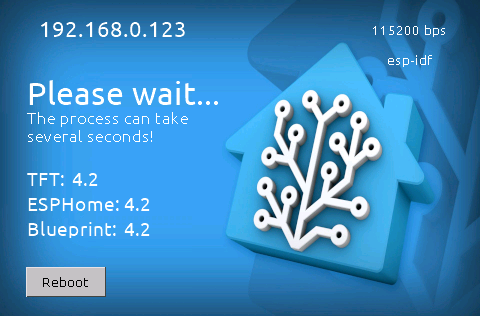

# Panel stuck on Boot page

When your panel starts, a number of different things needs to be set and the ESPHome must establish connection to the Nextion display used by your panel and also to your Home Assistant, which will provide the propper settings required by your panel. If everything goes right, the boot page will be shown for just a few seconds, then the wake-up page will be shown.

If something happens during this process, your panel may get stuck on this page. In many cases, restarting your panel can resolve the issue, but if after a reboot it still showing the boot page, this guide may help you.

Understanding what is shown on the boot page can be useful to find the cause of the problem or when you are looking for help.

## Understanding the boot page
Your boot page probably looks like this:
#### Before ESPHome is connected:

#### When ESPHome is connected:

### What is shown on the screen
#### Initializing or IP address
In the top, you will see the message "Initializing..." while the display is executing it's boot sequence or waiting for a connection from ESPHome.

Once ESPHome is connected to both the display and the Wi-Fi network, that text will be replace by the IP address, which can be useful for troubleshooting.

#### Baud rate (bps)
On the top right corner, it's shown the baud rate used by the display to communicate to ESPHome. By default, all the communication should happens at 115200 bps, but as 921600 bps is also supported, the display will alternate between these 2 rates every 30 seconds until ESPHome gets connected.

#### Framework
Right bellow the baud rate information, you may see the framework used by ESPHome, which is either `esp-idf` (default for new installations) or `arduino` (default for installations prior v4.1.4).

That information will be available only when ESPHome establishes communication with the display. If you cannot see that information after a couple of seconds then you may have an issue on the communication between ESPHome and the display (explained later).

#### Versions
Here you may see the version of TFT, ESPHome and Blueprint used by this project.

If some of those versions are not shown, you can have an indication of where a possible communication issue is.

- **TFT** version will always be shown, as that is part of the display itself.
- **ESPHome** version will be shown as soon the ESPHome establishes the communication with the display.
- **Blueprint** version requires both ESPHome and Blueprint to establish communication to be shown.

In normal situation, all the versions should be displayed and should be the same. Different patch versions are supported.

#### Reboot button
You can use this button to force a reboot of your panel. This button is available when ESPHome establishes communication with the display.

## Common issues
### ESPHome cannot establish communication to your panel's Nextion display
**Symptoms:** The ESPHome version (and other info) won't be shown in the boot page.

| Possible causes | Suggestions |
| :-- | :-- |
| You may have an older version of ESPHome installed or ESPHome is not installed. | Make sure you have the latest version of ESPHome and flash your device again. |
| You may have an older version of ESPHome installed or ESPHome is not installed. | Make sure you have the latest version of ESPHome and flash your device again. |
| Baud rate mismatch. | Make sure your yaml settings don't have any specific baud rate set or, if a custom baud rate is set, make sure it is one of the supported rates (115200 bps or 921600 bps). |

### Blueprint is not detected
**Symptoms:** The ESPHome version is shown, but not the blueprint version.

| Possible causes | Suggestions |
| :-- | :-- |
| You may have an older version of the blueprint installed or the blueprint isn't installed into your Home Assistant. | [Install the blueprint](https://my.home-assistant.io/redirect/blueprint_import/?blueprint_url=https%3A%2F%2Fgithub.com%2FBlackymas%2FNSPanel_HA_Blueprint%2Fblob%2Fmain%2Fnspanel_blueprint.yaml). [Update the blueprint](howto.md#update-blueprint).|
| You don't have an automation created using the blueprint. | On Home Assistant, go to **Settings** --> **Automations & Scenes** --> **Blueprints** --> **NSPanel Configuration** --> **CREATE AUTOMATION** and follow the [instructions to setup your automation](blueprint.md). **Attention!!** You need one automation per panel, if you have more than one panel set. |
| Your panel is not selected in the automation. | Open the automation related to your panel and make sure the right device is set on the **NSPanel device** field. |
| Reconnect the Panel's device to Home Assistant. | 1. Go to **Settings** --> **Devices & Services** --> **ESPHome** 2. Delete the device 3. Restart Home Assistant host 4. Go back to **Settings** --> **Devices & Services** 5. Click **Add integration** 6. Select **ESPHome** 7. Enter your panel's hostname or IP address.|

## Additional Tips and Resources
After troubleshooting, if issues persist, consult the [Issues](/Blackymas/NSPanel_HA_Blueprint/issues) and feel free to create a new one asking for more personalized assistance.

Please share as much info as possible, like:
1. Describing (or a picture of) what is in your screen
2. Are updating from a previous version of this same project, or coming from another NSPanel customization (which one?) or customizing for the first time a panel with original Sonoff settings?
3. Please share the ESPHome logs from when your panel starts to the moment the upload fails.
4. Describe what you have already tried.

## Important note
Remember, these steps are a guideline and might vary slightly based on your specific setup and previously installed system.
